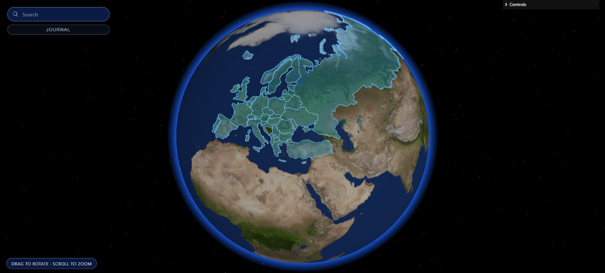

# A Whole New World

An interactive 3D globe for planning trips — browse countries, filter cities by the kind of
holiday you want, and build an itinerary without leaving the map.



## Why

Trip planning is a common source of stress, and most of that stress sits in organising an
itinerary rather than in any single booking. Existing tools are list-based; this project asks
whether a geographic, visual interface makes finding a destination easier. Answering that was
the point of the project, so the interface was evaluated with users rather than just built.

## What it does

- **Interactive globe** — rotate, zoom, and select countries directly on a WebGL globe
- **City markers** — click a city for its details and live weather
- **Vacation-type filters** — filter cities by tags such as beach, nature, adventure, culture, food, design, family, romantic; matching cities are highlighted at country level
- **Search** — jump to a country or city by name
- **Trip planner tray** — save destinations while browsing
- **Control centre** — adjust drag/zoom sensitivity, inertia, zoom limits, and auto-rotate
- **Resting state** — the globe spins on its axis after a period of inactivity

## Built with

| Layer | Tools |
|---|---|
| 3D rendering | Three.js (WebGL), three-globe, OrbitControls |
| Frontend | JavaScript, HTML/CSS, Vite |
| Backend | Node.js, Express — `GET /api/cities`, `GET /api/weather` |
| Geodata | Natural Earth (10m populated places), world-atlas country boundaries, processed in QGIS, converted with topojson-client |
| External API | OpenWeather (current conditions by coordinates) |
| Deployment | Render (frontend and backend served together) |

## Running it locally

```bash
git clone https://github.com/KasraAmirani/A-Whole-New-World
cd A-Whole-New-World
npm install
npm run dev
```

Live weather requires an OpenWeather API key. Create a `.env` file in the project root:


## Evaluation

The prototype was built iteratively and tested in two rounds of user evaluation, each combining
task-based testing (completion time and error count) with the System Usability Scale.

**Round 1** — SUS 88.75. Task times were mostly under 30 seconds with low error rates, but
testing surfaced real interaction problems: the globe span to unexpected positions after closing
a panel, city markers weren't clickable, selection feedback was unclear, returning to the country
view was unintuitive, sensitivity varied by device, and the information panel cut off content.

Each of those was treated as a design requirement. The next iteration stabilised globe behaviour,
made markers clickable, added visual selection feedback and a back button, added scroll support
and clearer signposting, made search more visible, and introduced the sensitivity control centre
and the filters.

**Round 2** — SUS 83.6, with task times comparable to the developer baseline and errors still low.
One outlier score of 32.5 traced back to phone use, which the prototype doesn't support.

On the research question, most participants agreed that both the globe interface and the
vacation-type filtering would improve how they find a destination. Several also went looking for
places they had in mind of their own accord, which wasn't part of the task.

## Limitations

- Not mobile-friendly; the interface assumes a desktop pointer and a wide viewport.
- Evaluations were done in a controlled setting on prescribed tasks, so they show usability rather than whether people would choose this over an existing travel service.
- Filtering was not yet fully integrated at the time of the second evaluation.

## Planned next

Refining the trip planner so an itinerary can be exported, exploring flight and accommodation
APIs, an exploratory mode for users with no destination in mind, and a "hidden gem" category.
The guiding rule is to improve clarity of what exists before adding anything new.

## Credits

Built with Inoue van den Berg for the Human–Computer Interaction and Information Visualisation
course at LIACS, Leiden University. Supervised by Michael Olthof and Prof. dr. ir. Fons J. Verbeek.
